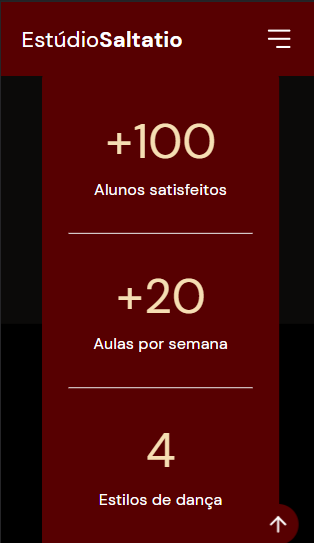

# Saltatio Studio - Landing page

Landing page criada para uma escola de dança, Saltatio Studio. Utilizei HTML, CSS e JavaScript, e tecnologias como Bootstrap e ScrollReveal. Pude aprimorar minhas habilidades no método Mobile First, treinando técnicas de responsividade para adaptar a tela aos dispositivos móveis e desktops.

### Desktop:

### Mobile

## Tecnologias utilizadas:

## 🤝 Contribuição

Projeto criado e adaptado por Suzana Fonseca, seguindo o modelo da NLWreturn, evento de programação escola Rockeatseat.

### Contato

